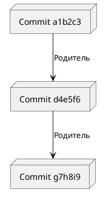
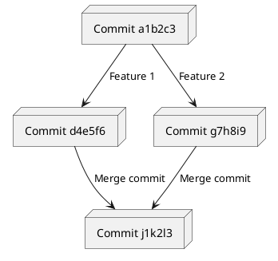
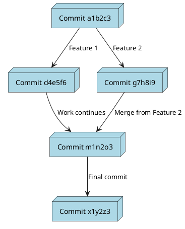

Для разработки **графа зависимостей коммитов**, где каждый узел содержит **хеш-значения коммитов**, можно использовать **PlantUML**. В таком графе каждый коммит будет представлен в виде узла, а стрелки покажут связи (зависимости) между коммитами.

---

## **1. Структура графа зависимостей коммитов**
В Git каждый коммит имеет:
- **Хеш-значение** (например, `a1b2c3d`).
- **Ссылку на родительский коммит** (предыдущий коммит).

Граф зависимостей коммитов можно представить как **ориентированный ациклический граф (DAG)**, где:
- Узлы – коммиты с их хешами.
- Стрелки – связи между коммитами.

---

## **2. Реализация графа зависимостей в PlantUML**

### **Синтаксис для узлов и связей**
В PlantUML узлы могут быть созданы как обычные текстовые блоки с уникальными именами. Связи между коммитами можно сделать с помощью **ориентированных стрелок (`-->`)**.

---

### **Пример 1: Базовый граф зависимостей коммитов**
Допустим, у нас есть коммиты с хешами: `a1b2c3`, `d4e5f6`, `g7h8i9`.



### **Результат**:
- Узел `a1b2c3` указывает на узел `d4e5f6`.
- Узел `d4e5f6` указывает на узел `g7h8i9`.

---

### **Пример 2: Ветвление в графе зависимостей**
В реальных системах контроля версий коммиты часто имеют **ветвления**, где один коммит может иметь несколько детей (или родители для merge-коммитов).



### **Результат**:
- Коммит `a1b2c3` порождает два ветвления: `d4e5f6` и `g7h8i9`.
- Коммит `j1k2l3` объединяет два коммита (`d4e5f6` и `g7h8i9`).

---

### **Пример 3: Добавление стилей и оформления**
PlantUML позволяет настроить внешний вид узлов и связей.



### **Что здесь добавлено**:
1. **Цвет фона** для узлов (`LightBlue`).
2. **Стрелки** с текстовыми описаниями связей.
3. Узлы с текстовыми хеш-значениями (`Commit x1y2z3`).

---

## **3. Генерация графа зависимостей коммитов**

1. Сохрани код в файл, например `commit_graph.puml`.

2. Используй **PlantUML** для генерации диаграммы:
   - Через локальный сервер:
     ```bash
     plantuml commit_graph.puml
     ```
   - Через онлайн-инструменты:
     - [PlantUML Online](https://plantuml.com/plantuml).
     - [Kroki.io](https://kroki.io).

---

## **4. Пример визуализации**
Диаграмма будет выглядеть следующим образом:

```
   Commit a1b2c3
       |
       v
   Commit d4e5f6     Commit g7h8i9
       |                 |
       v                 v
      Commit m1n2o3 <-- Merge --> Final Commit x1y2z3
```

---

## **5. Применение на практике**
1. **Отображение истории коммитов** в проекте.
2. **Визуализация веток и слияний** в Git-репозитории.
3. **Документирование процессов** разработки для команд.

---

### **Заключение**
Используя **PlantUML**, можно легко создать наглядный **граф зависимостей коммитов** с хеш-значениями, ветвлениями и merge-коммитами. Такой подход помогает анализировать историю изменений и упрощает документирование разработки. 🚀

Если у тебя есть конкретные примеры коммитов или веток, напиши – помогу создать граф! 😊